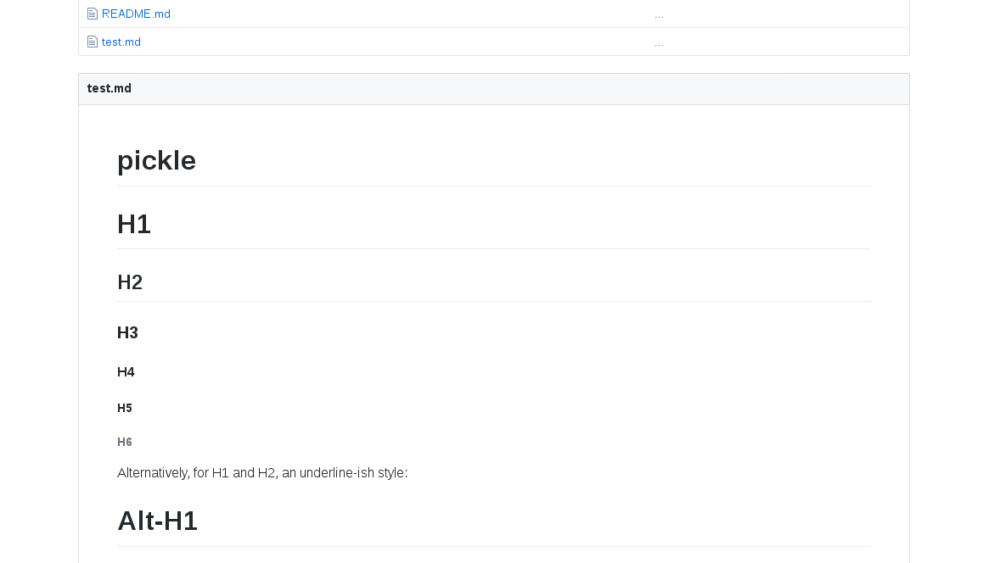

  
  
  
  

# pickle

Pickle is a tool to preview markdown syntax alike github, It use github api to generate an html file.

## Usage

I set an enviroment variable `PICKLETOKEN="abcd1234********************************"`
for a specifique file:

`$ ./pickle -file test.md -token $PICKLETOKEN`

for working directory:

`$ ./pickle -token $PICKLETOKEN`

And then open your browser on `localhost:7069` OR `[::1]:7069`

## Install

you will need `> go 1.9`

get the project `go get -u github.com/hihebark/pickle`

and then install `go install` or `go build`

## Screenshot

