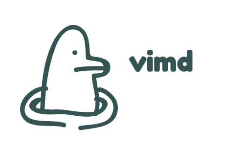

<p align="center">
  <a href="https://godoc.org/github.com/hihebark/vimd">
    
  </a>
  <a href="https://goreportcard.com/report/github.com/hihebark/vimd">
    
  </a>
  <a href="https://github.com/hihebark/vimd/blob/master/LICENSE.md">
    
  </a>
  <a href="https://travis-ci.org/hihebark/vimd">
    
  </a>
</p>

<p align="center"></p>

## Vimd
Stand for **Vi**sualise **M**ark**D**own, it's a tool to preview **MarkDown** files in the browser, to check if there is a misspelled or an error in the files.
The great about **Vimd** is its use Github API to render the page to an HTML, so when you push your code you will find it as when you did see it with Vimd.

_This tool it's only for previewing not editing._

## Usage
Simple usage:
```shell
$ vimd -p ~/go/src/github.com/bettercap/bettercap -token "1cecc595b1bc9329c28d3b94464883634f52c93" ↵
```
Saving file into a directory:
```shell
$ vimd -p README.md -s -o ~/readme.html ↵
```
Help message

```shell
$ vimd ↵

[ Vimd ] - 0.2.0

Usage of vimd:
  -o string
        The name and path of the output rendred HTML
  -p string
        Path that contain the markdown file(s) (default ".")
  -port string
        The serve port (default "7069")
  -s    Save the output into an html file(s)
  -token string
        Github personal accesss token
  -watch
        Reload when change is detected on the path (soon)
```

## Source Installation

The project is tested on those version of go `> go 1.9`

Get the project and install it by:

```shell
go get -u github.com/hihebark/vimd ↵
cd $GOPATH/src/github.com/hihebark/vimd ↵
go install #OR go build ↵
```
## License

`vimd` is made with ♥ by hihebark. It is released under the GPL3 license.
